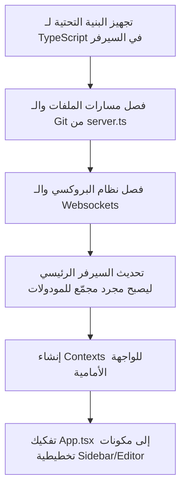

# 🛠️ خطة إعادة هيكلة المشروع (Refactoring Plan)

بناءً على تقييم الكود الحالي، فإن المشروع **ليس في حالة مثالية من حيث التنظيم والهيكلة**، على الرغم من أنه يعمل بشكل مستقر. هناك ملفات ضخمة جداً (Monolithic) تجمع مسؤوليات متعددة وتخالف مبدأ المسؤولية الفردية (Single Responsibility Principle).

---

## 🔍 تقييم الهيكل الحالي ومواطن الضعف

1. **`server.ts` (1978 سطر كود!):**
   - يجمع بين إعداد Express، وخادم الـ WebSockets.
   - يحتوي على معالجة العمليات الطرفية (PTY/Terminal).
   - يحتوي على خادم البروكسي وإعادة كتابة الـ HTML باستخدام Cheerio.
   - يدير عمليات Git، وملفات النظام، وفحص الشبكة، واستدعاءات Gemini API.
   - **المشكلة:** أي تعديل في جزء صغير قد يؤدي لتعطيل أجزاء أخرى، ويصعب كتابة اختبارات أحادية (Unit Tests) له.

2. **`src/App.tsx` (853 سطر كود!):**
   - يعمل كـ "مكون خارق" (God Component) يدير كل شيء: حالة الواجهة، الاتصال بالخادم، حالة تبويبات الملفات، حالة المحرر، حالة المحادثة مع الـ AI، وإعدادات المستخدم.
   - **المشكلة:** إعادة صيرورة (Re-rendering) متكررة وغير ضرورية للواجهة بأكملها عند أي تغيير بسيط في الحالة، وصعوبة صيانة الملف وتتبع الأخطاء.

---

## 🏗️ الهيكل الجديد المقترح (Modular Architecture)

سنقوم بتقسيم الملفات الكبيرة وتوزيع المسؤوليات على النحو التالي:

### 1. خادم الخلفية (Backend - `/server`)

```text
server/
├── index.ts                 # نقطة الدخول الرئيسية وتجهيز خادم HTTP/Websocket
├── config.ts                # إعدادات البيئة والثوابت
├── routes/                  # مسارات الـ Express مقسمة حسب الوظيفة
│   ├── fs.ts                # مسارات التعامل مع ملفات النظام
│   ├── git.ts               # مسارات التحكم بـ Git
│   ├── browser.ts           # مسارات خادم البروكسي والمتصفح المدمج
│   ├── workspace.ts         # إدارة مساحات العمل والمنافذ النشطة
│   └── ai.ts                # واجهة الـ API الخاصة بالذكاء الاصطناعي (Gemini)
├── websocket/               # إدارة جلسات الـ WebSockets والـ Terminal
│   └── terminal.ts          # معالج جلسات PTY والـ Terminal Multiplexing
└── utils/                   # دوال مساعدة مستقلة
    ├── cheerioProxy.ts      # كود إعادة كتابة الـ HTML للصفحات المبركسة
    └── logger.ts            # نظام تسجيل الأحداث والأخطاء
```

### 2. الواجهة الأمامية (Frontend - `/src`)

```text
src/
├── main.tsx
├── index.css
├── types/                   # تعريفات الأنواع (TypeScript Types)
│   └── index.ts
├── contexts/                # إدارة الحالة العالمية (Global State Management)
│   ├── WorkspaceContext.tsx # سياق حالة مساحة العمل (الملف النشط، شجرة الملفات)
│   └── AgentContext.tsx     # سياق المحادثة وتفاعل العميل الذكي
├── hooks/                   # خطافات مخصصة (Custom Hooks)
│   ├── useShortcuts.ts      # اختصارات لوحة المفاتيح
│   └── useTerminal.ts       # اتصالات الـ WebSockets للترمينال
└── components/              # المكونات الرسومية
    ├── layout/              # مكونات تخطيط الصفحة الرئيسية
    │   ├── Sidebar.tsx      # اللوحة الجانبية وتطبيقاتها
    │   ├── EditorArea.tsx   # منطقة المحرر والتبويبات
    │   └── TerminalArea.tsx # منطقة لوحة الترمينال السفلي
    └── common/              # مكونات عامة قابلة لإعادة الاستخدام (Buttons, Loaders, Dialogs)
```

---

## 📈 خطة العمل المقترحة للتنفيذ التدريجي

لتفادي كسر الميزات الحالية أثناء إعادة الهيكلة، نقوم بتقسيم العملية لخطوات مدروسة مع فحص التشغيل بعد كل خطوة:



---

### 💡 هل ترغب في البدء بإعادة هيكلة خادم الخلفية (Backend) أولاً كخطوة أولى لفصل `server.ts`؟
*(يمكنك الضغط على **Proceed** لاعتماد الخطة والبدء بالعمل عليها خطوة بخطوة).*
